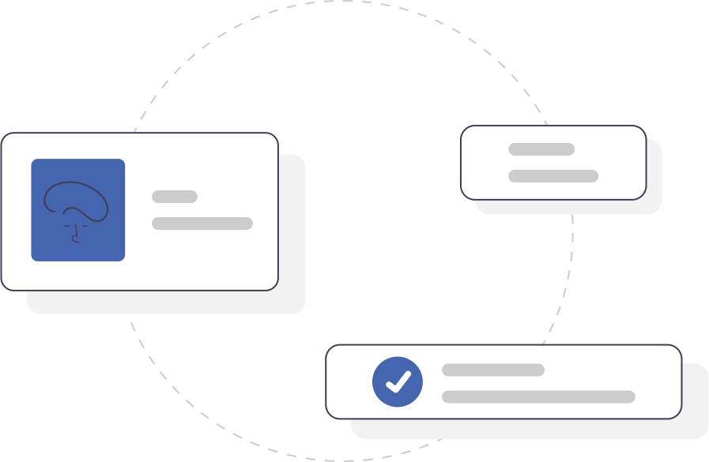

  
<i>Health and wellness for all.</i>

## Elsa Pediatrics Patient Intake Form

### Description

[Elsa Health](https://elsa.health) pediatric patient intake form is a digitized version of an established data collection form for children under the age of 14. This is the exact form used during Elsa Health studies and data collection forms.

The intentions of the digital form is to make easy and standardize the data collection process for pediatric digital data.

[Elsa Health](https://elsa.health) as an organization is commited to <b>equal access</b> to healthcare for all. We do this the best way we know how, by building technologies to augment the capacity and skills of decision makers (healthcare workers, governments, researchrs, parents, guardians, and individuals) to support optimal decision making. _Disease should be a thing of the past_

---
Quick Start

To get up and running really quickly simply:
- Clone this repository
- Run `yarn web` or `yarn ios` or `yarn android` to start any of those versions

---

### Want to contribute?

We love your input! We want to make contributing to this project as easy and transparent as possible, whether it's:

- Reporting a bug
- Discussing the current state of the code
- Submitting a fix
- Proposing new features
- Becoming a maintainer

If you want to contribute through code or documentation, the [Contributing guide](CONTRIBUTION.md) is the best place to start. If you have questions, feel free to ask.

This project adheres to [Elsa Health's code of conduct](CODE_OF_CONDUCT.md). By participating, you are expected to uphold this code.